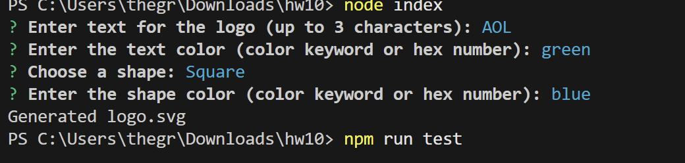
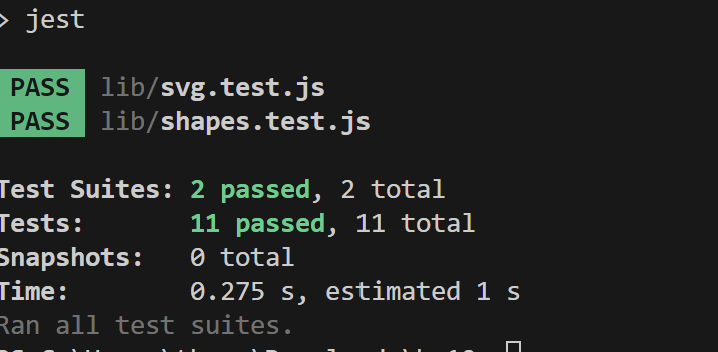

# 10 Object-oriented Programming: SVG Logo Maker Using Node.js
Walk through video link
https://drive.google.com/file/d/1Pwckp7cr_hq1y8UMKirOPGHD81FxDzV8/view
https://www.youtube.com/watch?v=QmXn6umiIDw

## Description
Use Node Inquirer to create questions from user to collect inputs from user to build a svg file. Then build 2 test files to test the svg creation and if the results pass the specifications. 

## Table of Contents
- [Installation](#installation)
- [Usage](#usage)
- [Contributing](#contributing)
- [Tests](#tests)
- [License](#license)
- [Questions](#questions)

## Installation
You need to npm i to install inquirer@8.2.4 and jest in order to run the program and test the program. then run the node index from command line to start the process, an logo.svg file should be created after the process.

## Usage
This can be use to auto generate an svg file based on user specification.

## Contributing

## Tests
node index to run test and answer all questions, then it should create an svg file. Then run npm run test to run validation tests.

## License

No license

## Media
### Example Photo

### Example Video
[Watch the Video](./Images/SGV%20Generator%20Demo.gif)
[Watch the Video](https://drive.google.com/file/d/1Pwckp7cr_hq1y8UMKirOPGHD81FxDzV8/view)
[Watch the Video](https://www.youtube.com/watch?v=QmXn6umiIDw)
## Questions
If you have any questions, please reach out to me:

GitHub: [thegreatwall88](https://github.com/thegreatwall88)
Email: thegreatwall88@gmail.com
